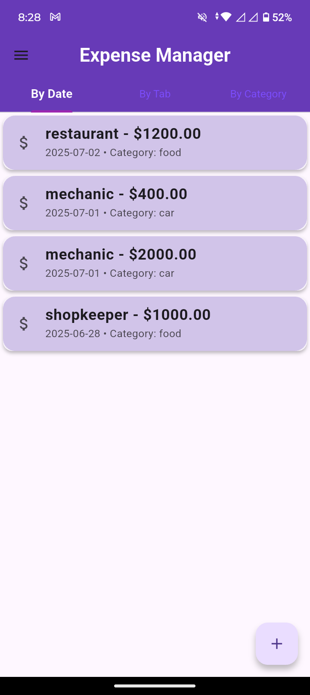
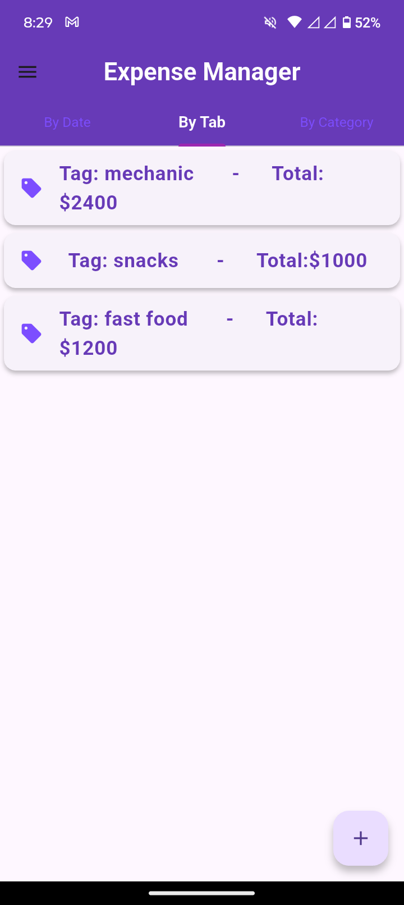
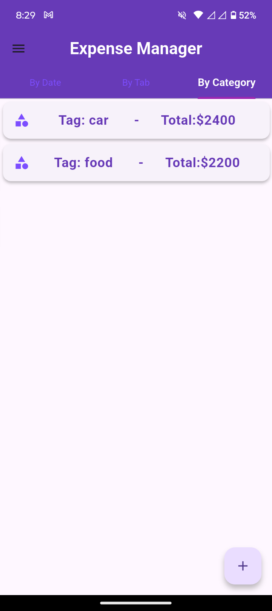

# Expense-Manager

# 💰 Expense Manager

A Flutter-based personal finance app to **track, manage, and analyze expenses** efficiently. Organize your daily spendings using categories and tags, and get insightful breakdowns by date, category, and tag.


---

## ✨ Features

- ✅ Add, Edit, Delete Expenses
- 📅 View Expenses by **Date**
- 📂 Add & Delete **Categories**
- 🔖 Add & Delete **Tags**
- 📊 View total spending:
  - by **Category**
  - by **Tag**
- ⚡ Simple & elegant UI using Material3
- 💾 Persistent **LocalStorage** (no internet required)

---

## 📸 Screenshots

| Home Screen (By Date) | Manage Categories | By Tag / Category Summary |
|-----------------------|-------------------|----------------------------|
|  |  |  |

---

## 🛠️ Built With

- **Flutter** (3.x)
- **Provider** for state management
- **localstorage** for persistent data
- **intl** for date formatting
- **flutter_slidable** for swipe-to-delete/edit

---

## 📂 Project Structure

lib/
├── model/
│   ├── expense_model.dart
│   ├── category_model.dart
│   └── tag_model.dart
├── provider/
│   ├── expense_provider.dart
│   ├── category_provider.dart
│   └── tag_provider.dart
├── screens/
│   ├── home_screen.dart
│   ├── add_expense_screen.dart
│   ├── manage_category_screen.dart
│   ├── manage_tag_screen.dart
│   ├── byDate_tabScreen.dart
│   ├── byTag_tabScreen.dart
│   └── byCategory_tabScreen.dart
├── utils/
│   └── widgets/
│       ├── custom_text_widget.dart
│       ├──dropTextField_category_widget.dart
│       ├──dropTextField_tag_widget.dart
└── main.dart
---

## 🚀 Getting Started

1. **Clone the repository:**
   ```bash
   git clone https://github.com/UmarOnTheGo/Expense-Manager.git
   cd Expense-Manager
   ```
   
2. **Install the dependencies:**
  ```bash
  flutter pub get
  ```

3. **Run:**
```bash
  flutter run
```

4. **To build a release version of your app for Android:**
   ``` bash
   flutter build apk --release
   ```
The apk will be located at 
  ```
  build/app/outputs/flutter-apk/app-release.apk
```
